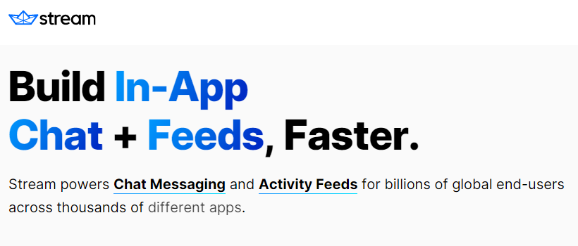

# Fastify backend for the ChatApp

[ChatApp](https://github.com/da8ah/react-chatapp)

## Funcionalidades
- [x] Signup
- [x] Signin
- [x] Logout

## Dependencias
- Fastify 4.14.1
- Fastify Cors 8.2.0
- Stream Chat 8.4.1

## Descripción

Esta aplicación sencilla utiliza [getstream.io](https://getstream.io/) para implementar un chat funcional que permite la comunicación con una o varias personas. Los chats se manejan mediante la asignación de roles a sus miembros permitiendo tener una estructura jerárquica organizada para la gestión de las comunicaciones y el control del chat. Esto facilita la distribución de responsabilidades de administración y moderación de cada chat. Para la implementación se ha utilizado el SDK de React.
 
